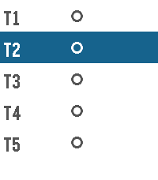
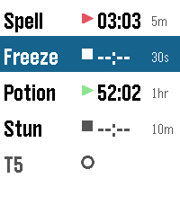
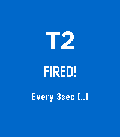
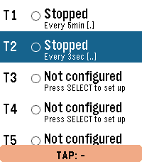

# LARP Timer

A Pebble smartwatch app for tracking multiple simultaneous cooldown timers during live-action roleplay (LARP). Designed to let you manage spell durations, ability cooldowns, and in-game timing without breaking immersion — no need to look at your watch to know which timer fired.

---

## Screenshots

| Main Screen | Two Timers Running | Flash Alert | Tap Interface |
|:-----------:|:------------------:|:-----------:|:-------------:|
|  |  |  |  |

---

## Current State

Fully functional watchapp targeting the **Pebble Time 2 (Emery)** platform, built with the Pebble C SDK 4.17.

### Features

**5 independent timers (T1–T5)**, each configurable with:
- **Interval type:** Hourly, every X minutes (1–120), or every X seconds (1–59)
- **Vibration pattern:** 6 distinct patterns so you can identify which timer fired by feel alone

| Pattern | Feel |
|---------|------|
| Single `·` | One short pulse |
| Double `··` | Two short pulses |
| Triple `···` | Three short pulses |
| Long `—` | One long buzz |
| Long-Short `—·` | Long then short |
| Short-Long-Short `·—·` | Short, long, short |

**When a timer fires:**
- Vibrates with its unique pattern
- Full-screen **colour-coded flash** for 2 seconds — each timer has its own colour (red/blue/green/yellow/magenta) with the timer name displayed large

**Tap-to-start interface (no-look operation):**
1. Wrist tap → arms the selector, yellow `TAP: -` bar appears at screen bottom
2. N more taps within 2 seconds → `TAP: T1`, `TAP: T2`, etc.
3. After 2s timeout → starts or stops that timer automatically

**Button navigation:**
- **UP / DOWN** — scroll through T1–T5
- **SELECT** — action menu: Start/Stop or Configure
- **BACK** — exit / dismiss flash overlay

**Configuration wizard** (SELECT → Configure):
1. Choose interval type
2. Enter value via number wheel (UP/DOWN adjust, SELECT confirms)
3. Pick vibration pattern — pre-selects your current setting

Timer configs and last-selected row persist across app launches.

---

## Install

### Emulator
```bash
pebble install --emulator emery
```

### Real Pebble (via Cloudpebble or phone)
```bash
pebble install --cloudpebble
```

Or sideload the PBW directly from `build/larp-timer.pbw` via the Pebble app.

### Build from source
```bash
pebble build
```
Requires [Pebble SDK 4.x](https://developer.rebble.io/developer.pebble.com/sdk/index.html).

---

## Intentions / Roadmap

This app started as a practical tool for LARP gameplay and is being developed toward a more complete session companion. Planned additions:

- **Custom timer names** — replace T1–T5 with player-chosen labels (e.g. "Spell", "Potion", "Stun") using a preset name picker
- **More timers** — expand beyond 5 (up to the memory limit)
- **Start All / Stop All** — single action to launch or halt the full set
- **Countdown warnings** — secondary vibration at a configurable "warning" threshold before the timer fires (e.g. buzz 30s before end of an effect)
- **Per-timer colour customisation** — choose from the Pebble palette rather than using fixed defaults
- **Session profiles** — save and restore named sets of timer configurations for different game systems or character builds
- **Pebble app store release** — publish once the above QoL features are in place

---

## Project Structure

```
larp-timer/
├── src/c/main.c        # Full app source (~800 lines, single file)
├── package.json        # App manifest (UUID, display name, platform)
├── wscript             # Waf build script
├── build/
│   └── larp-timer.pbw  # Compiled watchapp bundle
└── screenshot_*.png    # Emulator screenshots (Emery platform)
```

---

## Platform

Targets **Emery (Pebble Time 2, 200×228 colour rectangular)**. The build system and C code are portable to other Pebble platforms (basalt, chalk, diorite) with minor geometry adjustments — colour features degrade gracefully on B&W platforms via `PBL_IF_COLOR_ELSE`.
